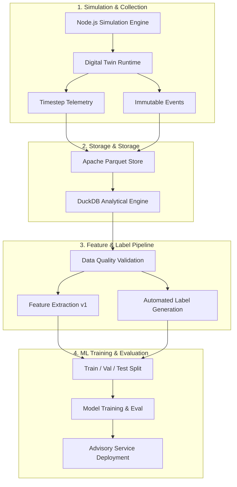

# Mars Digital Twin Dataset Lifecycle & Training Pipeline

This document describes the end-to-end dataset generation, validation, feature engineering, and training pipeline for the AntriX Mars Autonomous System.

---

## 1. Dataset Generation Lifecycle

---

## 2. Dataset Pipeline Rules

1. **Deterministic Seeds**: Every generated episode dataset is keyed by `(scenario_id, seed)`.
2. **Authoritative Ground-Truth Labels**: Labels (`mission_success`, `battery_failure`, `obstacle_collision`, `safety_rejection`) are generated directly from simulation state and events. Models never produce their own ground-truth labels.
3. **Data Quality Gatekeeping**: Datasets are validated for timestamp monotonicity, non-negative battery values, and valid state transitions before feature extraction.
4. **Versioned Contracts**: Datasets record `dataset_version`, `simulation_version`, `scenario_version`, and `feature_version`.
